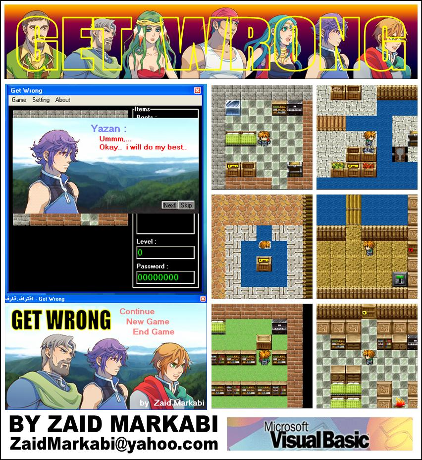

## RPG Game\+Editor

### Description

Get Wrong

----

[ Get-Wrong ] is nice game, written in VB6 , and it's like RPG games .

it's include great [ Level Editor ] which let you to add new blocks and items...

This game comes with over 100 items and 4 levels .

if you have any comments, just tell me..

your comments help me to improve my hobby in programming..
 
### More Info
 

             |
---                |---
**Submitted On**   |2009-05-13 23:20:56
**By**             |[Zaid Markabi](https://github.com/Planet-Source-Code/PSCIndex/blob/master/ByAuthor/zaid-markabi.md)
**Level**          |Intermediate
**User Rating**    |5.0 (10 globes from 2 users)
**Compatibility**  |VB 5\.0, VB 6\.0
**Category**       |[Games](https://github.com/Planet-Source-Code/PSCIndex/blob/master/ByCategory/games__1-38.md)
**World**          |[Visual Basic](https://github.com/Planet-Source-Code/PSCIndex/blob/master/ByWorld/visual-basic.md)
**Archive File**   |[RPG\_Game\+E2155206172009\.zip](https://github.com/Planet-Source-Code/zaid-markabi-rpg-game-editor__1-72187/archive/master.zip)

